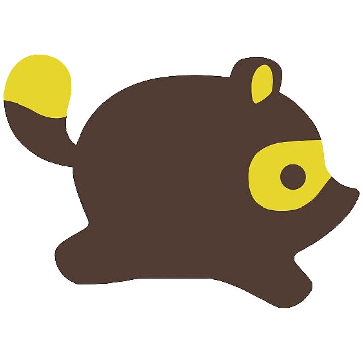

# Nook+

Organizational app for players of [Animal Crossing: New Horizons](https://animalcrossing.fandom.com/wiki/Animal_Crossing%3A_New_Horizons).



## Installation

```sh
docker-compose run composer install
docker-compose run yarn install
```

## Generating Data

```sh
./scripts/data.sh
```

## Generating Images

```sh
./scripts/images.sh
```

## Generating Icons

```sh
./scripts/homescreen.sh
```

## Building

```sh
docker-compose run yarn build
```
